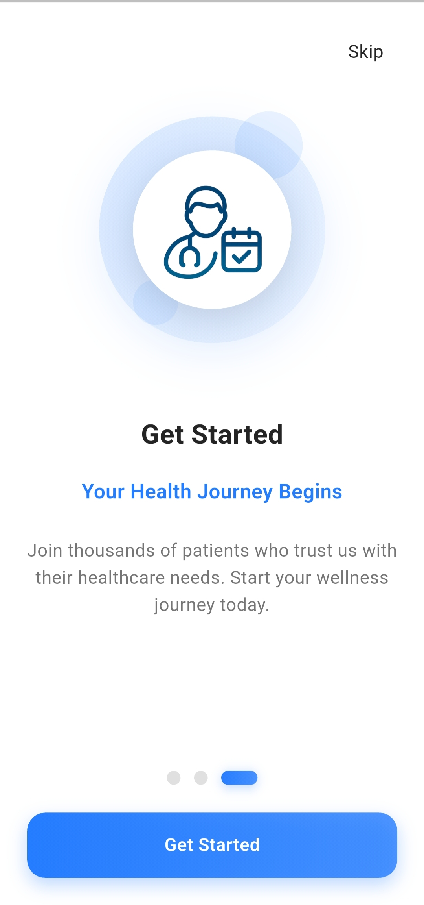
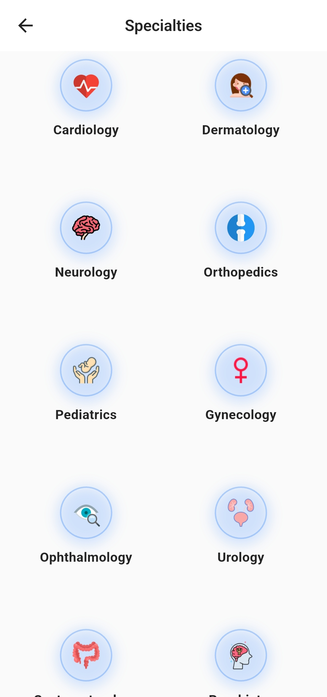
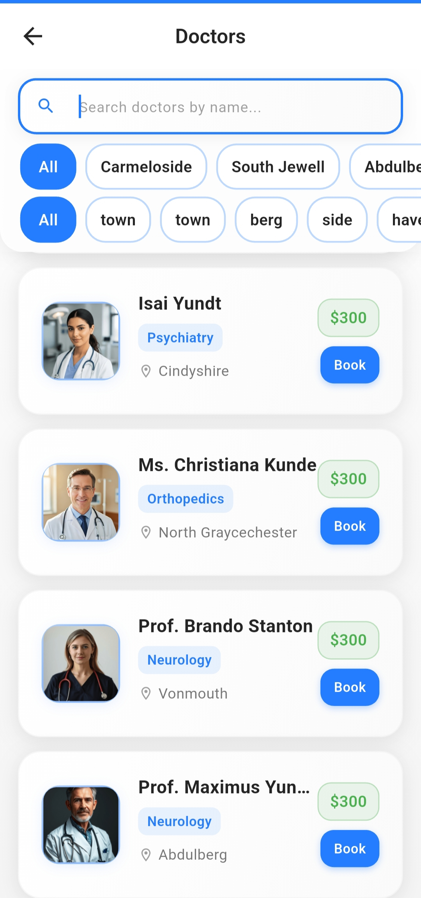
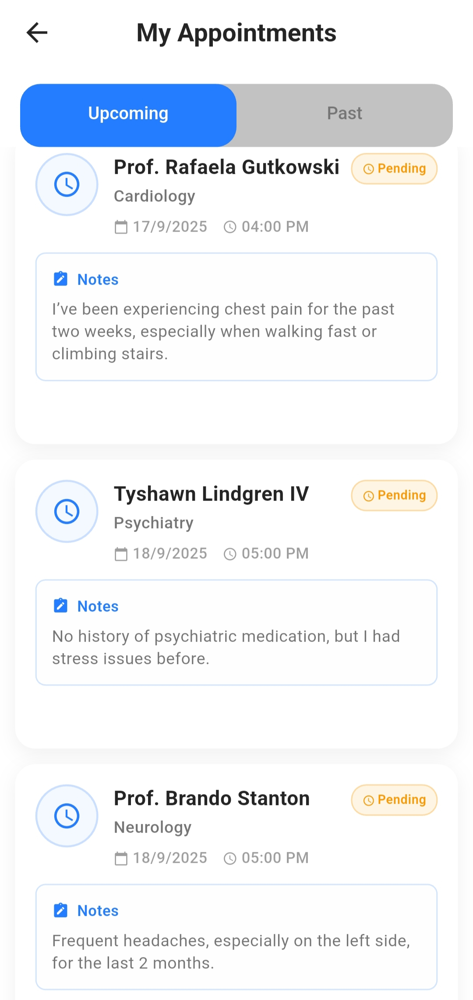
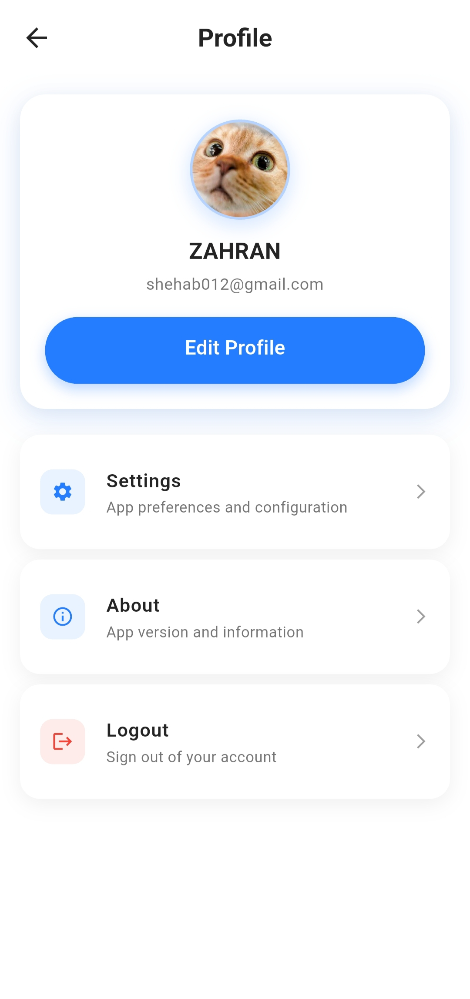

# Appointly – Flutter Doctor Appointment App

A clean, simple doctor appointment app built as a graduation project. Browse specializations, view doctor profiles, and book appointments. The app connects to the VCare Live backend.

## Screenshots

| Onboarding | Home | Speciality |
| --- | --- | --- |
|  |  |  |

| Search | My Appointments | Profile |
| --- | --- | --- |
|  |  |  |

## Contribute

Developed as a graduation project by Yousef Zahran. Feedback, academic collaboration, and improvement suggestions are warmly welcomed.

